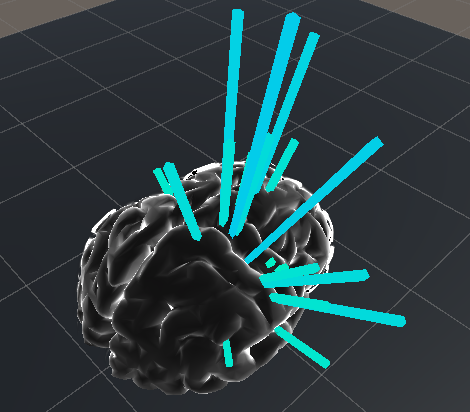

# vr-eeg-visualization

## Project Info
This project is an attempt to visualize EEG data in virtual reality. The project builds off an existing
EEG visualization project in Unity (see reference links below)

## Reference Links
[EEG-Brain-Simulator](https://github.com/tashisha/EEG-Brain-Simulator)

[Unity3D-Globe](https://github.com/Dandarawy/Unity3D-Globe)

